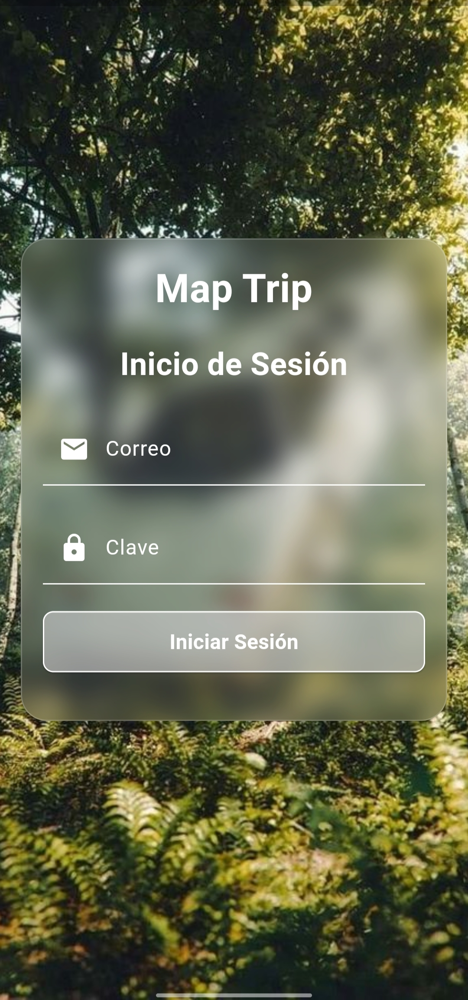
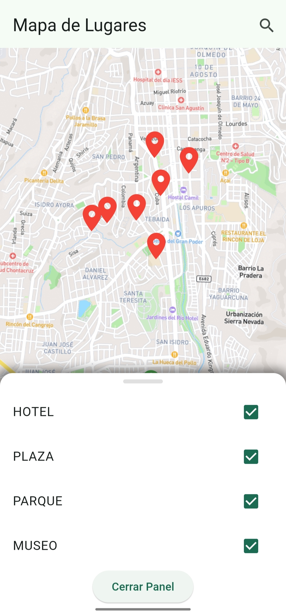

# 📱 MAP TRIP

MAP TRIP es una aplicación diseñada para consultar lugares populares de la ciudad de Loja según su tipo. Este proyecto está desarrollado utilizando **Express.js** para el backend y **Flutter** para la aplicación móvil.

<div style="display: flex; justify-content: space-between;">
  
  
</div>


## 🔧 Tecnologías Utilizadas

- **Express.js**: Framework de Node.js utilizado para construir el backend de la aplicación.
- **Flutter**: Framework de desarrollo de aplicaciones móviles utilizado para construir la interfaz de usuario.

## 🏗 Funcionalidades

- Búsqueda de lugares populares en Loja.
- Filtrado de lugares por tipo (hoteles, restaurantes, parques, museos, etc.).
- Visualización en una mapa.

## ⚙️ Instalación

### Backend (Express.js)

1. Clona el repositorio:
    ```bash
    git clone https://github.com/JhandryChimbo/MapTrip.git
    ```
2. Navega al directorio del backend:
    ```bash
    cd map-trip/backend
    ```
3. Instala las dependencias:
    ```bash
    npm install
    ```
4. Inicia el servidor:
    ```bash
    npm start
    ```

### Frontend (Flutter)

1. Navega al directorio del frontend:
    ```bash
    cd map-trip/frontend
    ```
2. Instala las dependencias:
    ```bash
    flutter pub get
    ```
3. Inicia la aplicación:
    ```bash
    flutter run
    ```

## 🚀 Uso

1. Abre la aplicación móvil en tu dispositivo android o emulador.
2. Utiliza la barra de búsqueda para encontrar lugares populares en Loja.
3. Filtra los resultados según el tipo de lugar que te interese.
4. Visualiza en el mapa los lugares señalados

## 🤝 Contribuciones

Las contribuciones son bienvenidas. Por favor, sigue los siguientes pasos:

1. Haz un fork del repositorio.
2. Crea una nueva rama (`git checkout -b feature/nueva-funcionalidad`).
3. Realiza tus cambios y haz commit (`git commit -am 'Añadir nueva funcionalidad'`).
4. Sube tus cambios (`git push origin feature/nueva-funcionalidad`).
5. Abre un Pull Request.
